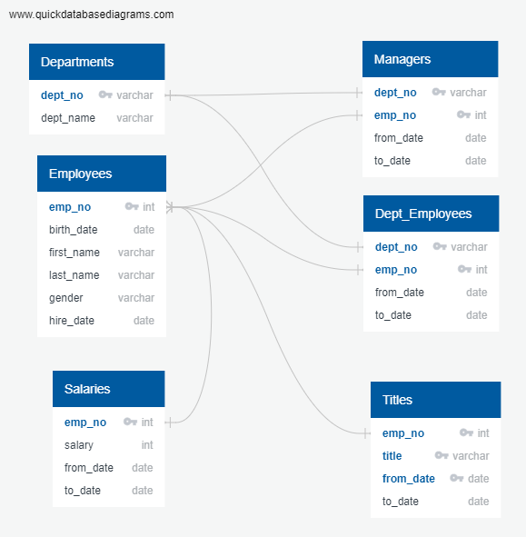
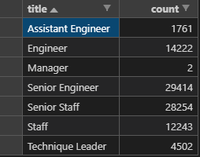
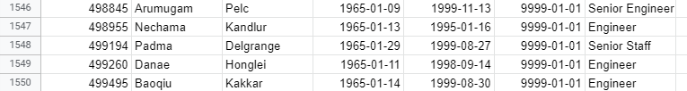

# pewlett_hackard-analysis

## Project Overview
Pewlett Hackard, a very large tech company with thousands of employees, is anticipating a large number of their employees to begin retiring. The company wants to find out who is eligible for their retirement package. Many retiring employees leads to many new job positions that need to be filled. Pewlett Hackard also wants to implement a new mentorship program, that will have retiring employees mentor an eligible employee to take their position. The company has yet to build a database of all the employee information, so before I can begin my analysis, I first will need to put together an ERD (Entity Relationship Diagram) and then using the ERD, I will be able to construct an extensive database for the company. The pieces of information that I will be gathering are:

- A list of current employees and their information
- Who will be retiring and will be eligible for the retirement package
- The title of the retiring employee
- How many people will be retiring
- Which employees are eligible for the new mentorship program

## Resources
- Data: 
		- data/departments.csv
		- data/employees.csv
		- data/dept_manager.csv
		- data/dept_emp.csv
		- data/salaries.csv
		- data/titles.csv
- Software: 
	- SQL
	- PGAdmin 4
	- PostgreSQL
	
## Entity Relationship Diagram

## Results

- There are a total of 62,144 employees that will soon retire. 
- The majority of retiring employees come from senior engineer and senior staff positions.
- Only 1549 employees are eligible for the mentorship program.
- Out of all the retiring employees, only 2 managers are retiring.

## Summary
Overall, Pewlett Hackard will need to fill a total of 62,144 positions in the near future. Luckily there are many capable retirement ready individuals are will be able to mentor the next generation of employees.